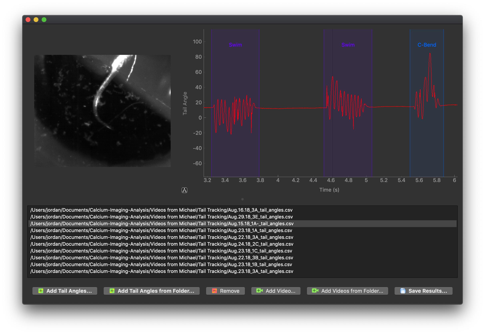

# Behavior-Classification
Software for manually classifying zebrafish swim behavior from tail traces and videos.

## Requirements
This software requires Python 2 or 3, and the following modules:
* numpy
* opencv-python
* pyqtgraph
* PyQt4 (for Python 2) or PyQt5 (for Python 3)
